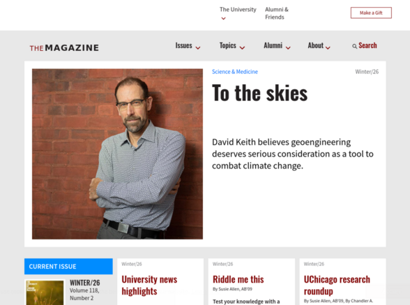

# Mag 2026 — a standalone Drupal 10/11 magazine theme

A modern, **dependency-free** rebuild of a university magazine theme for Drupal
10 and 11. Mag 2026 reproduces the original design pixel-for-pixel while
removing every runtime dependency the old theme carried: **no Bootstrap base
theme, no Bootstrap CSS/JS, no jQuery plugins from a CDN, no Font Awesome, and
no third-party trackers.** Everything it needs ships inside the theme.



It began life as `mag2`, a Drupal **Bootstrap 3** sub-theme. This version keeps
the look and the markup contract but replaces the framework underneath it with a
small, hand-written CSS layout system and a few vanilla-JS behaviours.

---

## Why this is interesting

| Before (`mag2`) | After (`mag2026`) |
| --- | --- |
| `base theme: bootstrap` (a large contrib theme) | **standalone** — `base theme: false` |
| Bootstrap 3.4.1 CSS + JS loaded from **jsDelivr CDN** | **`css/framework.css`** — a ~450-line float grid/navbar/forms layer |
| jQuery, Font Awesome, matchHeight, ekko-lightbox from CDNs | **vanilla JS** (`js/mag2026.js`) + Drupal core's jQuery |
| Google Fonts loaded from `fonts.googleapis.com` | **self-hosted** woff2 (`fonts/fonts.css`) |
| Google Analytics, Matomo, Facebook Pixel, Marketo hard-coded in `html.html.twig` | **removed** (analytics belong in site config, not a theme) |
| ~25 duplicate `*(copy).twig` files, 5 near-identical per-term `html` overrides | cleaned up; the per-term logic is one preprocess function |
| A 2,100-file Font Awesome LESS tree checked in | dropped; the one icon used is inline SVG |

The result loads **zero external requests** and drops the entire Bootstrap
dependency, yet renders identically on desktop and mobile.

---

## Architecture

```
mag2026/
├── mag2026.info.yml         # standalone theme, 11 regions, one library
├── mag2026.libraries.yml    # single "global" library (CSS + JS + fonts)
├── mag2026.theme            # minimal preprocess (see “Form handling” below)
├── css/
│   ├── framework.css        # the Bootstrap replacement: grid, navbar,
│   │                        #   dropdowns, buttons, forms, utilities, icon
│   └── style.css            # the magazine look & feel (typography, colours,
│                            #   layout) — ported from the original
├── fonts/
│   ├── fonts.css            # @font-face for self-hosted Source Sans Pro + Oswald
│   ├── *.woff2              # the font files (latin + latin-ext subsets)
│   ├── socialicious/        # footer social icon font (self-contained)
│   └── justvector-icons/    # icon font (self-contained)
├── js/
│   ├── mag2026.js           # vanilla navbar collapse, dropdowns, equal-height,
│   │                        #   lightbox — replaces the Bootstrap/CDN JS
│   ├── script.js            # magazine UI (search reveal, most-read toggle …)
│   └── toggles.js           # the toggle-switch plugin (most read / most shared)
├── img/ · logo.svg · favicon.ico · screenshot.png
└── templates/               # ~70 Twig overrides (html, page, node, views, …)
```

### The CSS framework (`css/framework.css`)

Only the Bootstrap 3 features the site actually used are reimplemented — with
the **same class names and measurements** so the existing markup and the ported
`style.css` are unchanged:

- **Grid** — 12 columns, 15px gutters, breakpoints 768 / 992 / 1200px, plus the
  `col-md-push-3` / `col-md-pull-9` reordering the sidebar/content layout needs.
  It is **float-based, not flexbox**, on purpose: the site's Views listings drop
  bare `.col-sm-4` cells into a wrapper *without* a flex `.row` parent and rely
  on Bootstrap's floating columns to flow side by side.
- **Navbar** — `.navbar`, `.navbar-collapse`, the hamburger toggle and the
  `.collapse`/`.in` show-hide contract used by `js/mag2026.js`.
- **Dropdowns** — `.dropdown`/`.dropdown-menu`/`.caret` (click + hover).
- **Forms & buttons** — `.form-control`, `.form-group`, `.btn`.
- **Icons** — the one Bootstrap glyphicon used (search) and the dropdown caret
  are drawn as inline SVG, so no icon font is required.

### JavaScript

`js/mag2026.js` provides, as vanilla `Drupal.behaviors`, the four things that
used to come from CDN plugins: navbar collapse, menu dropdowns, equal-height
story tiles (was `jQuery.matchHeight`) and an image lightbox (was
`ekko-lightbox`). `js/script.js` keeps the magazine's own UI (search reveal,
the most-read/most-shared toggle, filter relabelling) and uses **Drupal core's
jQuery** rather than a bundled copy.

### Form handling (`mag2026.theme`)

The classic theme inherited two form conveniences from Bootstrap that the Twig
templates still expect. These are reimplemented in ~40 lines of preprocess:

- `hook_preprocess_input()` adds `.form-control` to text-like inputs and
  `.btn`/`.btn-info` to submits.
- `hook_preprocess_form_element()` sets the `is_form_group` / `is_radio` /
  `has_error` flags `form-element.html.twig` uses.

A third preprocess adds the alternate-colour `alumnitheme` body class on the
alumni sections — replacing five nearly identical `html--taxonomy--term--NNN`
template copies with one small function.

---

## Installation

```bash
# From your Drupal docroot:
drush theme:enable mag2026
drush config:set system.theme default mag2026
drush cache:rebuild
```

Or enable it at **Appearance** in the admin UI and set it as default.

### Migrating from the `mag2` theme

Block placements are stored **per theme**, so a site switching from `mag2` needs
its blocks re-placed under `mag2026` (same regions). The block config is
identical apart from the theme/id prefix; the custom block *content* is shared,
so the fastest path is to duplicate each `block.block.mag2_*` entity as
`block.block.mag2026_*` with `theme: mag2026` (a dozen lines with the block
entity storage API). New sites can simply place blocks normally.

---

## Site features & content model

This theme was built for a university alumni magazine. The templates are tightly
coupled to the content model below, which is useful context for reading them.

### Content types

| Type | Purpose | Template |
| --- | --- | --- |
| **Story** | The core article. | `node--story.html.twig` |
| **Magazine Issue** | A published issue (cover, PDF, table of contents). | `node--magazine-issue.html.twig` |
| **In the News** | Short alumni-in-the-news items. | `node.html.twig` |
| **Mag Carousel Image** | Slides for the homepage carousel. | via views |
| **Generic** | Static pages (advertising, masthead, contact…). | `node.html.twig` |

**Story** fields the templates render: `field_letter_box_story_image` (lead
image), `field_caption`, `field_subhead`, `field_refauthors` (→ contributors
vocabulary), `field_refsource`, `field_issue`, `body`, `field_reftopic` /
`field_tags` / `field_refuchicago` / `field_refformats` (taxonomy tagging),
`field_relatedstories`, `field_relatedlinks`, `field_storymedia`,
`field_story_ext_link`.

**Magazine Issue** fields: `field_issue_num`, `field_issue_cover`,
`field_issue_cover_credit`, `field_issue_pdf`, `field_issue_summary`,
`field_core_sidebar`, `field_core_issue_toc` (the table of contents), `body`.

### Taxonomy

`topics` (Arts & Humanities, Science & Medicine, …), `formats` (Alumni Essay,
Notes, Releases — the "alumni" sections), `contributors_and_authors`, `tags`,
`publication_sources`, `multimedia`.

### Key pages & Views

- **Front page** — a hero "front feature" (`mag_front_feature`), a homepage
  story grid (`mag_homepage_stories`), a **Current Issue** block
  (`mag_current_issue_block`), a **Top Stories** block with a *most read /
  most shared* toggle (`mag_top_stories`), and a carousel.
- **Current Issue** (`/current-issue`) & **Back Issues** (`/back-issues`) —
  `page--current-issue.html.twig` / `page--back-issues.html.twig`.
- **Story pages** — lead image, Oswald display title, byline/source/issue meta,
  body with related stories, a "Current Issue" sidebar (push/pull layout).
- **Magazine Issue pages** — cover + PDF download + a multi-column table of
  contents (the `wrap1` grouping is done in `js/script.js`).
- **Taxonomy term listings** — topic/format archives (`taxonomy_term` view),
  with the alternate `alumnitheme` palette on alumni formats.
- **Search** — a Search API view (`mag_search_2`) driven by the header search
  field, revealed by the magnifier in the nav.

---

## Fonts & licensing

Bundled web fonts are self-hosted subsets of **Source Sans Pro** and **Oswald**,
both under the SIL Open Font License. The `socialicious` and `justvector` icon
fonts retain their original licenses (see their folders).

---

## Standards

- Drupal 10 / 11 (`core_version_requirement: ^10 || ^11`).
- No base theme, no build step — plain CSS, plain JS, standard Twig overrides.
- No external network requests at runtime.
- **Drupal 11 ready:** the `drupal/upgrade_status` scanner reports zero issues
  for this theme — no deprecated APIs and no removed Twig syntax.
